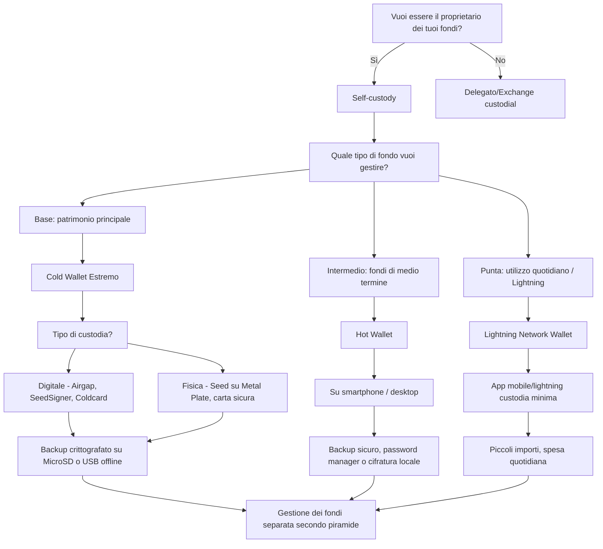

---
{"dg-publish":true,"permalink":"/bitcoin/guide-e-consigli/come-scegliere-il-wallet-giusto-flow-chart/","title":"📊 Come scegliere il wallet giusto - Flow Chart","tags":["Bitcoin","SelfCustody","Wallet","ColdWallet","HotWallet","Lightning","Guida"],"dg-note-properties":{"title":"📊 Come scegliere il wallet giusto - Flow Chart","description":"Diagramma decisionale per organizzare i wallet in base a ruolo, custodia e livello di rischio.","tags":["Bitcoin","SelfCustody","Wallet","ColdWallet","HotWallet","Lightning","Guida"],"date":"2025-12-25"}}
---

# 📊 Come scegliere il wallet giusto - Flow Chart

🧭 **Questa guida ti aiuta a scegliere come organizzare i tuoi wallet Bitcoin** secondo la piramide dei fondi.

Non esiste "un wallet perfetto per tutto". La strategia migliore è **diversificare** in base all'uso e al livello di sicurezza richiesto.

---

## 🏔️ La Piramide dei Fondi

Organizza i tuoi bitcoin su **tre livelli**, come una piramide:

### 🔵 Base → Patrimonio Principale
- **Importo:** La maggior parte dei tuoi bitcoin (70-90%)
- **Wallet:** [[Bitcoin/Definizioni/Blockchain/Cold Wallet\|Cold Wallet]] estremo ([[Bitcoin/Wallet/Hardware Wallet/❄️ Coldcard\|❄️ Coldcard]], [[Bitcoin/Wallet/Hardware Wallet/✍️ SeedSigner\|✍️ SeedSigner]], [[Bitcoin/Wallet/Hardware Wallet/🔶 Passport\|🔶 Passport]])
- **Accesso:** Raramente (mesi/anni)
- **Sicurezza:** Massima

### 🟡 Intermedio → Fondi di Medio Termine
- **Importo:** Fondi per risparmi a breve-medio termine (10-25%)
- **Wallet:** Hot wallet su smartphone/desktop ([[Bitcoin/Wallet/Software Wallet/🐦 Sparrow Wallet\|🐦 Sparrow Wallet]], [[Bitcoin/Wallet/Software Wallet/⚡ Electrum\|⚡ Electrum]])
- **Accesso:** Occasionale (settimane/mesi)
- **Sicurezza:** Media-alta

### 🟢 Punta → Uso Quotidiano
- **Importo:** Spese quotidiane (1-5%)
- **Wallet:** [[Bitcoin/Lightning Network/⚡ Lightning Network\|⚡ Lightning Network]] wallet (Phoenix, Breez, Zeus)
- **Accesso:** Frequente (giornaliero)
- **Sicurezza:** Base (importi piccoli)

---

## 🧩 Diagramma Decisionale

---

## 🎯 Raccomandazioni per Livello

### 🔵 Base (Cold Storage)

**Wallet consigliati:**
- [[Bitcoin/Wallet/Hardware Wallet/❄️ Coldcard\|❄️ Coldcard]] → massima sicurezza, Bitcoin-only
- [[Bitcoin/Wallet/Hardware Wallet/🔶 Passport\|🔶 Passport]] → elegante, airgapped, Bitcoin-only
- [[Bitcoin/Wallet/Hardware Wallet/✍️ SeedSigner\|✍️ SeedSigner]] → DIY, completamente airgapped
- [[Bitcoin/Wallet/Hardware Wallet/🔸 KeyStone\|🔸 KeyStone]] → grande display, multi-wallet

**Best practices:**
- ✅ Usa [[Bitcoin/Definizioni/Blockchain/🔐 Multisig\|🔐 Multisig]] per importi molto grandi
- ✅ Backup della [[Bitcoin/Definizioni/Blockchain/🧠 Seed Phrase\|🧠 Seed Phrase]] su [[Bitcoin/Wallet/🪨 Steelwallet\|🪨 Steelwallet]]
- ✅ Testa il recovery prima di depositare grandi somme
- ✅ Considera [[Bitcoin/Eredità in Bitcoin\|Eredità in Bitcoin]] per la famiglia

### 🟡 Intermedio (Hot Wallet)

**Wallet consigliati:**
- [[Bitcoin/Wallet/Software Wallet/🐦 Sparrow Wallet\|🐦 Sparrow Wallet]] → desktop, funzionalità avanzate
- [[Bitcoin/Wallet/Software Wallet/⚡ Electrum\|⚡ Electrum]] → leggero, veloce, affidabile
- BlueWallet → mobile, user-friendly

**Best practices:**
- ✅ Usa password forte e [[Bitcoin/Definizioni/Blockchain/🔐 Self-custody\|🔐 Self-custody]]
- ✅ Backup cifrato della seed phrase
- ✅ Non tenere più di quanto sei disposto a perdere
- ✅ Aggiorna regolarmente il software

### 🟢 Punta (Lightning)

**Wallet consigliati:**
- Phoenix → auto-custodial, semplice
- Breez → non-custodial, buona UX
- Zeus → per utenti avanzati

**Best practices:**
- ✅ Tieni solo piccoli importi
- ✅ Ricarica regolarmente dal wallet intermedio
- ✅ Backup dei canali Lightning
- ✅ Usa per pagamenti quotidiani e micropagamenti

---

## ⚠️ Errori Comuni da Evitare

### ❌ Tutto su un Exchange
**Problema:** [[Bitcoin/Filosofia/🚫 Evita gli exchange\|🚫 Evita gli exchange]] - Non sono tuoi bitcoin  
**Soluzione:** Sposta su [[Bitcoin/Definizioni/Blockchain/🔐 Self-custody\|🔐 Self-custody]]

### ❌ Tutto su un Solo Wallet
**Problema:** Rischio concentrato, nessuna diversificazione  
**Soluzione:** Usa la piramide dei fondi

### ❌ Hot Wallet per Grandi Somme
**Problema:** Vulnerabile ad attacchi online  
**Soluzione:** Sposta su [[Bitcoin/Definizioni/Blockchain/Cold Wallet\|Cold Wallet]]

### ❌ Nessun Backup
**Problema:** Perdi il device = perdi i bitcoin  
**Soluzione:** [[Bitcoin/Guide e consigli/1️⃣ Come creare una seed phrase in modo sicuro\|1️⃣ Come creare una seed phrase in modo sicuro]]

---

## 🔥 Conclusione

📊 **Non esiste un wallet perfetto per tutto.**

La strategia migliore è:
1. 🔵 **Base** → Cold wallet per il patrimonio
2. 🟡 **Intermedio** → Hot wallet per risparmi accessibili
3. 🟢 **Punta** → Lightning per uso quotidiano

💡 Inizia con piccole somme, impara a usare i wallet, poi scala gradualmente.

**La sicurezza dei tuoi bitcoin dipende da te.**

---

🔗 _Approfondisci con [[Bitcoin/Guide e consigli/🔑 Come creare un Wallet (non custodial)\|🔑 Come creare un Wallet (non custodial)]], [[Bitcoin/Wallet/Hardware Wallet/Hardware Wallet\|Hardware Wallet]], [[Bitcoin/Definizioni/Blockchain/🔐 Self-custody\|🔐 Self-custody]], [[Bitcoin/Lightning Network/⚡ Lightning Network\|⚡ Lightning Network]], [[Bitcoin/Definizioni/Blockchain/Cold Wallet\|Cold Wallet]], [[Bitcoin/Wallet/Software Wallet/🐦 Sparrow Wallet\|🐦 Sparrow Wallet]]_
