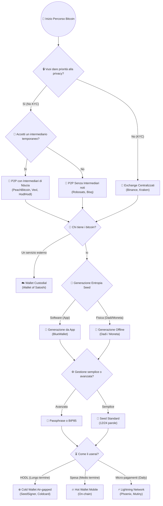
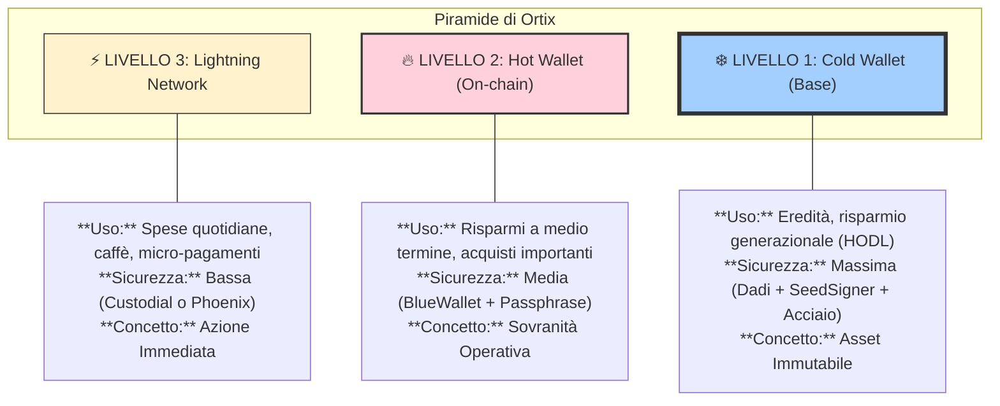

# 🧭 Bitcoin: Dove iniziare

Questa guida ti aiuta a navigare le scelte fondamentali per riprendere il controllo del tuo denaro, applicando i principi di **Ortix**.

---

## 🛣️ Il Tuo Percorso Bitcoin

Ogni scelta che fai sposta l'equilibrio tra **Comodità** e **Sovranità**. Usa questo schema per decidere il tuo approccio.

---

## 🧭 Come usare questa mappa

🧠 **Questa non è una checklist tecnica**, ma una **mappa mentale**.  
Serve per rispondere a una sola domanda:

> 👉 _Da dove parto con Bitcoin, senza fare casino?_

Ogni bivio rappresenta **una scelta di responsabilità e fiducia**. Non esiste una strada giusta per tutti, ma esiste la strada giusta per il tuo attuale livello di competenza e necessità. 

---

## 🔒 Privacy come primo filtro

🔑 La prima domanda non è _che wallet usare_, ma: **Quanto sei disposto a farti conoscere?**

- **KYC (Know Your Customer)**: Gli Exchange centralizzati (Binance, Kraken) sono comodi e veloci, ma richiedono i tuoi documenti. Questo crea un legame indelebile tra la **tua identità reale** e i tuoi [[Bitcoin/Definizioni/Blockchain/UTXO\|UTXO]]. In un mondo di [[Ortix/Economica comportamentale/Ingegneria del pensiero\|Ingegneria del pensiero]] e sorveglianza, questo è un rischio per la tua [[Bitcoin/Filosofia/🕵️‍♂️ Privacy\|🕵️‍♂️ Privacy]].
- **No‑KYC**: Acquistare senza documenti tramite [[Bitcoin/P2P/P2P\|P2P]] protegge la tua sovranità. È l'applicazione pratica del [[Politica/⚖️ NAP\|⚖️ NAP]]: nessuno ha il diritto di sapere quanto denaro possiedi.

---

## 🤝 Fiducia negli altri (Escrow)

👥 Se scegli il percorso [[Bitcoin/P2P/P2P\|P2P]] (Peer-to-Peer), devi decidere come gestire il rischio di controparte:

- **[[Bitcoin/P2P/P2P Centralizzato\|P2P Centralizzato]]**: Ti fidi di un'azienda o di un bot che faccia da arbitro (Escrow) in caso di dispute. In tal caso puoi usare [[Bitcoin/P2P/Strumenti/BitcoinVoucherBot\|BitcoinVoucherBot]], [[Bitcoin/P2P/Strumenti/PeachBitcoin\|PeachBitcoin]] o [[Bitcoin/P2P/Strumenti/Vexl\|Vexl]]. È più semplice ma introduce un punto di fallimento centrale.
- **[[Bitcoin/P2P/P2P Decentralizzato\|P2P Decentralizzato]]**: Usi protocolli come [[Bitcoin/P2P/Strumenti/Robosats\|Robosats]] o [[Bitcoin/P2P/Strumenti/Bisq\|Bisq]] dove la fiducia è sostituita dalla crittografia e da depositi di sicurezza. È la massima espressione della [[Ortix/Filosofia/🛡️ Sovranità digitale\|🛡️ Sovranità digitale]].

---

## 🔑 Custodia: il vero spartiacque

⚠️ Qui Bitcoin cambia davvero: **Chi controlla le chiavi controlla i bitcoin.**

- **Wallet Custodial**: Stai usando un servizio (come Wallet of Satoshi). È utile per imparare, ma tecnicamente sono "bitcoin di qualcun altro". Se il servizio chiude, perdi tutto.
- **Self‑custody**: Sei tu l'unico proprietario. Senza [[Bitcoin/Definizioni/Blockchain/🔐 Self-custody\|🔐 Self-custody]], non hai proprietà privata, hai solo un credito verso un terzo.

---

## 🎲 Generazione Entropia (Seed)

🧠 Quando crei le tue chiavi, scegli il tuo **modello mentale di fiducia** per la generazione della casualità (entropia):

- **Software (App)**: Ti fidi dell'algoritmo di un'app come [[Bitcoin/Wallet/Software Wallet/🔵 BlueWallet\|🔵 BlueWallet]]. È sicuro per la maggior parte degli utenti e segue gli standard [[Bitcoin/Definizioni/BIP/BIP 39 – Mnemonic Seed Phrases\|BIP 39]].
- **Fisica (Dadi/Moneta)**: Non ti fidi di nessun software. Usi i [[Bitcoin/Come creare un wallet/🥇 Metodo 3 — Crazione di un wallet Livello Difficile\|dadi o moneta]] per generare entropia pura. È il massimo livello di sovranità: la tua chiave nasce dalla fisica, non dal silicio.

---

## ⚙️ Semplice o Avanzato (Gestione del Wallet)

📝 All'inizio, **semplice batte perfetto**:

- **Seed Standard**: 12 o 24 parole scritte su carta o [[Bitcoin/Wallet/🪨 Steelwallet\|🪨 Steelwallet]]. È lo standard d'oro per chi inizia.
- **Passphrase**: Aggiungere una "25ª parola" (come visto nel [[Metodo 2 — Crazione di un wallet Livello Medio\|Metodo Medio]]) per creare wallet nascosti o "civetta". Richiede molta disciplina: se perdi la passphrase, il seed è inutile.
- **BIP85**: Una tecnica avanzata per derivare molti wallet da un unico "Master Seed". Ideale per chi vuole gestire una [[Bitcoin/Wallet/🌳 Wallet gerarchico\|gerarchia di wallet]] senza dover conservare decine di backup diversi.

---

## ⏳ Uso nel tempo: HODL, Spending e Lightning

Bitcoin è un sistema, non un singolo wallet. Devi dividere i tuoi fondi in base all'orizzonte temporale e alla frequenza d'uso:

- **❄️ Cold Wallet (HODL)**: Risparmio a lungo termine. Usi dispositivi **Air-gapped** come [[SeedSigner\|SeedSigner]] o [[Coldcard\|Coldcard]] che non toccano mai internet. È il tuo caveau personale.
- **🔥 Hot Wallet (Spending)**: Somme per acquisti importanti o ricariche. Comodo, veloce, ma on-chain.
- **⚡ Lightning Network**: Per i micro-pagamenti quotidiani (caffè, mance). È istantaneo e quasi gratuito. Puoi usare app come [[Bitcoin/Wallet/Software Wallet/🕊 Phoenix Wallet\|🕊 Phoenix Wallet]] o [[Bitcoin/Wallet/Software Wallet/Breeze\|Breeze]] per mantenere la sovranità anche sul Layer 2. Vedi [[Bitcoin/Lightning Network/⚡ Lightning Network\|⚡ Lightning Network]] per approfondire.

---

## 🧭 Messaggio finale (importantissimo)

🪜 **Questo percorso non è definitivo.** La bellezza di Bitcoin è che puoi evolvere. Puoi iniziare con un acquisto KYC su un exchange, passare a un hot wallet in self-custody, e col tempo imparare a usare i dadi e il cold storage.

👉 Bitcoin non ti chiede di essere perfetto.  
👉 Ti chiede solo di essere **consapevole**.

---

#bitcoin #selfcustody #privacy #p2p #lightning #hodl #educazione

---

## 🏗️ La Piramide della Sovranità (Wallet Hierarchy)

Non tutti i Bitcoin hanno lo stesso scopo. Dividi i tuoi fondi in base all'utilizzo e al rischio, integrando i concetti di Ortix.

---

## 🔗 Integrazione con la Filosofia Ortix

- **Mente ([[🧠 Terapia Cognitivo-Comportamentale (CBT)\|CBT]])**: Scegliere il livello di sicurezza adatto riduce l'ansia da perdita e la paranoia. La consapevolezza dei rischi è la base della calma finanziaria.
- **Azione ([[Ortix/Filosofia/🛡️ Sovranità digitale\|Sovranità Digitale]])**: Usare strumenti come Robosats o Bisq protegge la tua identità dall'[[Ortix/Economica comportamentale/Ingegneria del pensiero\|Ingegneria del pensiero]] e dalla sorveglianza statale.
- **Asset ([[Politica/⚖️ NAP\|NAP]])**: La self-custody è l'unica difesa contro l'aggressione economica del sistema [[Ortix/Filosofia/🌍 FIAT\|🌍 FIAT]]. Possedere le chiavi significa che nessuno può violare la tua proprietà privata senza il tuo consenso.

---

## 🚀 Prossimi Passi

1. **Inizia dal basso**: Crea un wallet con il [[Metodo 1 — Crazione di un wallet Livello Facile\|Metodo Facile]].
2. **Sali di livello**: Sperimenta con la [[Metodo 2 — Crazione di un wallet Livello Medio\|Passphrase]] per creare wallet civetta.
3. **Diventa Sovrano**: Prova la generazione con i [[Metodo 3 — Crazione di un wallet Livello Difficile\|Dadi]] per eliminare ogni fiducia nel software.

---

> 🧡 *"La tua sovranità è proporzionale alla tua responsabilità."*

[[Ortix/Filosofia/🧠 Ortix: La Sintesi della Sovranità\|🧠 Ortix: La Sintesi della Sovranità]] | [[Bitcoin/Bitcoin\|Bitcoin]] | [[Bitcoin/Definizioni/Blockchain/🔐 Self-custody\|🔐 Self-custody]]
