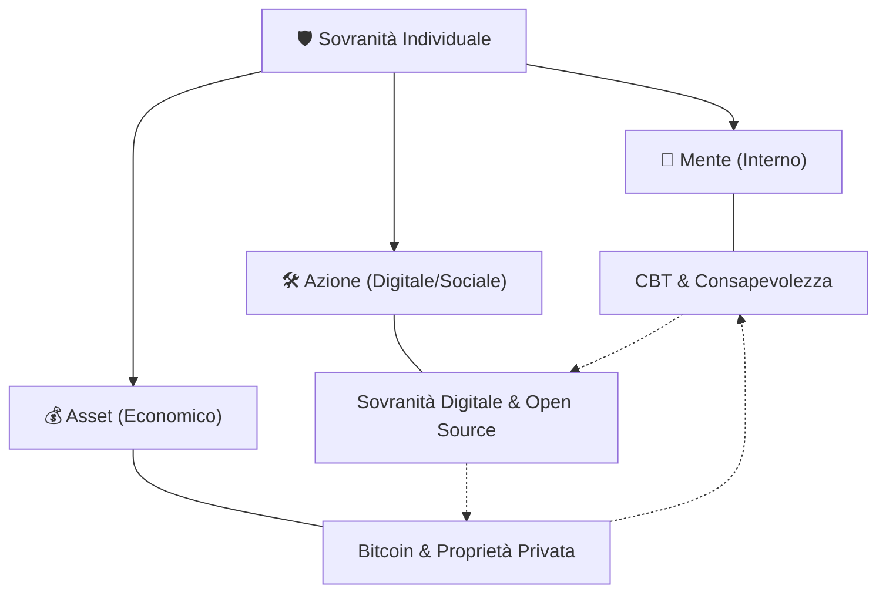

# 🧠 Ortix: La Sintesi della Sovranità

La filosofia di **Ortix** non è un insieme di strumenti isolati, ma un percorso coerente verso la **Sovranità Individuale**. 

In un mondo che spinge verso la dipendenza (economica, tecnologica e mentale), Ortix propone un ritorno al centro: **tu come unico proprietario di te stesso.**

---

## 🏗️ I Tre Pilastri della Sovranità

Per essere veramente liberi, la sovranità deve essere esercitata su tre livelli interconnessi:

### 1. 🧠 Sovranità della Mente (Il Fondamento)
Senza il controllo dei propri pensieri, ogni altra libertà è un'illusione.
- **Strumento:** [[🧠 Terapia Cognitivo-Comportamentale (CBT)\|🧠 Terapia Cognitivo-Comportamentale (CBT)]]
- **Concetto:** Riconoscere le distorsioni cognitive e l'[[Ortix/Economica comportamentale/Ingegneria del pensiero\|Ingegneria del pensiero]] per evitare di essere manipolati da algoritmi e propaganda.
- **Pratica:** [[Ortix/Filosofia/🧘‍♀️ Detox Digitale\|🧘‍♀️ Detox Digitale]] e [[Ortix/Filosofia/🌐 Apnea Digitale\|🌐 Apnea Digitale]] per riprendere il controllo dell'attenzione.

### 2. 🛠️ Sovranità dell'Azione (Il Mezzo)
Come interagisci con il mondo senza chiedere permessi.
- **Strumento:** [[Ortix/Filosofia/🛡️ Sovranità digitale\|🛡️ Sovranità digitale]] e [[Bitcoin/🧬 Open Source\|🧬 Open Source]]
- **Concetto:** Applicare il [[Politica/⚖️ NAP\|Principio di Non Aggressione]] al mondo digitale. Se non controlli il software, il software controlla te.
- **Pratica:** [[Ortix/Storage/🔄 Syncthing\|🔄 Syncthing]] per i dati, [[Bitcoin/📡 Nostr\|📡 Nostr]] per la comunicazione, [[Ortix/Filosofia/🐧 Linux\|🐧 Linux]] per il sistema operativo.

### 3. 💰 Sovranità degli Asset (Il Risultato)
La capacità di conservare il frutto del proprio lavoro nel tempo e nello spazio.
- **Strumento:** [[Bitcoin/Bitcoin\|Bitcoin]]
- **Concetto:** La [[Politica/🔒 Privato vs Pubblico\|Proprietà Privata]] è l'unica difesa contro la coercizione. Il problema centrale è il sistema [[Ortix/Filosofia/🌍 FIAT\|🌍 FIAT]], che agisce come un "Anti-Asset" svalutando il tuo tempo.
- **Pratica:** [[Bitcoin/Definizioni/Blockchain/🔐 Self-custody\|🔐 Self-custody]] e rifiuto del sistema [[FIAT\|FIAT]].

---

## 🔗 Il Ciclo Virtuoso

Questi concetti si alimentano a vicenda:
1. Una **mente consapevole** (CBT) capisce l'importanza della **privacy** e della **proprietà**.
2. Gli **strumenti sovrani** (Open Source/Linux) proteggono la mente dalle distrazioni e dalla sorveglianza.
3. Il **denaro scarso** (Bitcoin) fornisce le risorse per mantenere l'indipendenza e premia la visione a lungo termine.

---

## 🚀 Da dove iniziare?

Il giardino di Ortix cresce un seme alla volta. Non serve cambiare tutto oggi, serve iniziare a **coltivare**.

- 📖 Leggi il [[Politica/📜 Manifesto Libertario\|📜 Manifesto Libertario]] per capire l'etica.
- 🛠️ Segui la guida [[Bitcoin/🧭 Bitcoin Dove iniziare\|🧭 Bitcoin Dove iniziare]] per l'azione.
- 🧘‍♂️ Pratica la [[Ortix/Filosofia/🥬 Dieta digitale\|🥬 Dieta digitale]] per la mente.

---

> 🧡 *"La libertà non è un traguardo, ma una pratica quotidiana di sovranità."*

[[Ortix/Filosofia/🌱 Come lavora Ortix\|🌱 Come lavora Ortix]] | [[Bitcoin/🏠 Benvenuto in Ortix\|🏠 Benvenuto in Ortix]]
